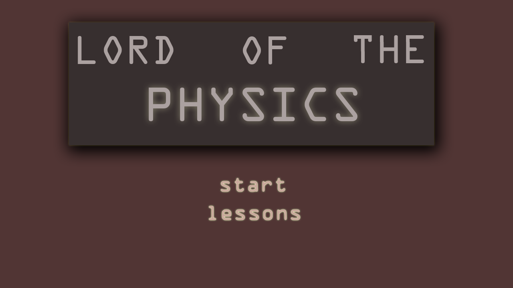

# Description

A simple puzzle game making use of Box2D Physics engine for realistic physics simulations. It currently has 10 puzzles and some finishing is required.

## Usage 

1. Start a local web-server and access index.html from it to run the game.  

2. Google Chrome Browser is recommended.  

3. You can also play the game on your phone by installing the desired Android apk on your device.  